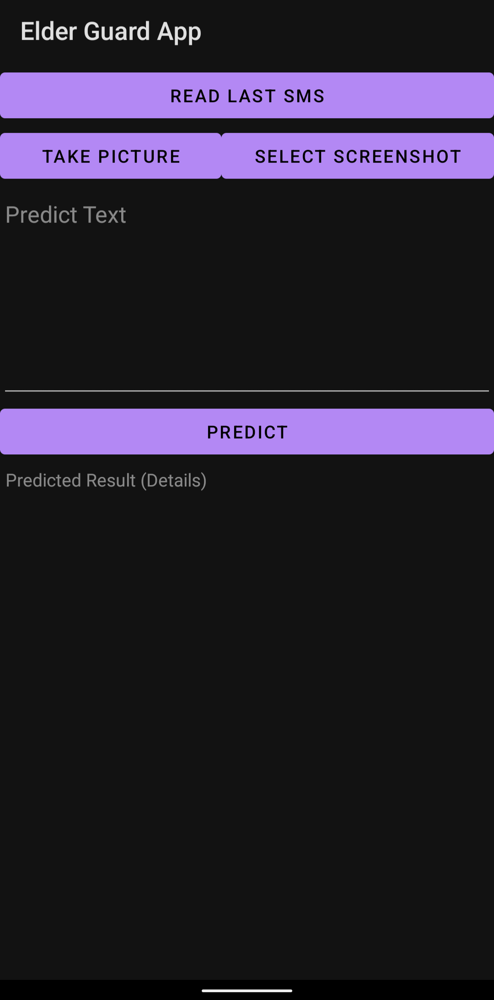

# ElderGuard  

An Android app that helps the elderlies in filtering spam text, malicious and phishing URLs in mobile text messages

  
&nbsp; &nbsp; &nbsp; &nbsp;
  
&nbsp; &nbsp; &nbsp; &nbsp;
   

---

## EXECUTIVE SUMMARY
With Singapore moving towards digitalization, elderlies are starting to embrace the use of smart phones in their daily lives. This inadvertently exposes them to malicious content that send through their smart phones. When our elderlies, who may not be tech-savvy, receive messages containing malicious link or spam, they might unknowingly click on malicious contents without second thoughts. As a results, it leads to financial loss or identity theft if the link is unsafe or malicious. 

Our team perceive the need for an application can help to detect text messages that may be fraudulent in nature, for example, spam, fraud messages or messages that contain malicious or phishing URLs. In the hope that elderlies can connect to a colourful digital life safely and prevent them from being scammed or cheated. Thus, we developed a machine learning driven application that provides the capability of predicting the safety of a text message content. 

An Android application, ElderGuard, is built for users to forward messages and obtain the predicted results. The predictive engine which contains three machine learning modules, ie. Spam Detection, Phishing URL Detection, and Malicious URL Detection are deployed and hosted in Heroku. Prior deployment, the team has conducted model training for each of the modules using multiple supervised machine learning method including Naïve Bayes, Logistic Regression, Decision Tree, Random Forest, AdaBoost, Support Vector Machine (SVM), K-Nearest Neighbours as well as some deep learning neural network architecture like Convolutional Neural Network (CNN), Long Short-Term Memory (LSTM) Neural Network and the combination CNN-LSTM. Upon model training, the team performed model evaluation based on few performances’ metric including F1-score, AUC-score and testing accuracy score for selecting the best model to be deployed in Heroku. When users forward messages for predicting, the predictive engine in Heroku will pass through the three machine learning modules, depends on if the messages containing text messages only or with URL, to come out with results. And finally, through ElderGuard Android Application, users will receive a green tick to show that the text message is safe or a red cross-sign to show that the text message is unsafe.

---

## CREDITS / PROJECT CONTRIBUTION

Team: 
Lim Jun Ming 
Mediana 
Yeong Wee Ping

---

## ELDERGUARD - FINAL PRESENTATION & DEMO

PRS-PM - ELDERGUARD - MACHINE LEARNING BASED PREDICTION - SPAM TEXT - MALICIOUS URL - PHISHING URL  
[**Final Presentation**](Presentation/Final Presentation/PRS_Group18_ElderGuard_Presentation.pptx)

---

## INSTALLATION

`Download and install the ElderGuard.apk at Github Folder ElderGuardApp_Android_Apk to your android system`

---
## PROJECT REPORT / PAPER

`Refer to project report at Github Folder: Project Report`

---
## MODEL TRAINING

`Refer to notebooks at Github Folder: Model Training`

---
